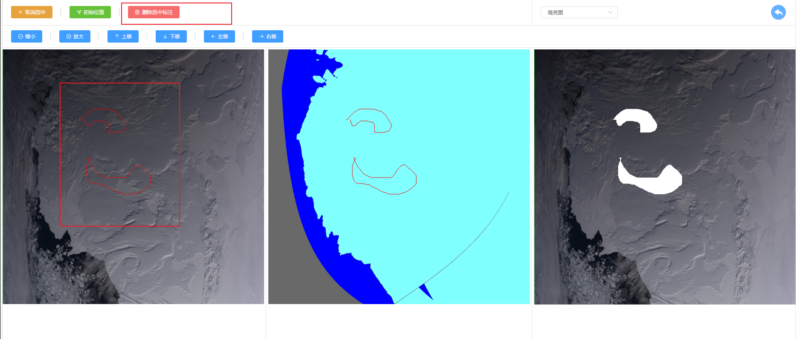

# 海冰标注工具后端
## 简介
该标注工具具有以下功能：
1. 导入图片（需要同时导入RGB、ICE两种图片，仅支持png,jpg类型图片）
2. 标注功能
3. 删除标注
4. 删除图片
5. 下载标注完成的图片
## 界面展示
1. index界面（4个文件夹代表4种图片，分别是rgb、ice、黑白以及高亮图，点击即可进入文件夹）

2. 图片列表界面（点击“标注”即可进入标注界面，点击“编辑”可进入编辑界面，点击“删除”即可删除该图片）

3. 标注界面（只有同时导入RGB、ICE时才能正常显示，当只导入一种图片时，会提示出错）

4. 添加标注（按住鼠标左键或用电子笔在图片上圈出要标注区域，然后点击提交按钮即可添加标注，一次可提交多个标注区域）

5. 可以查看标注后的高亮图和黑白图

6. 删除标注（首先进入编辑界面，用鼠标左键或电子笔点击要删除的标注圈，此时标注圈会变红，再点击删除键即可删除该标注）

7. 删除图片（在图片列表界面点击删除按钮即可删除图片）
8. 导入图片（在RAWRGB或RAWICE文件夹下，点击上传图片按钮，即可上传图片）

9. 下载图片（在图片列表文件夹下，勾选要下载的图片，再点击下载按钮即可下载）

## 部署运行
### 数据库导入
1. 如果未安装数据库，需要先安装数据库（如mysql、SQL Server、Oracle等）
2. 本项目所用数据库名为images，若想要更换为自定义的数据库名，只需将[application.properties](src/main/resources/application.properties)中数据库名修改为自己的数据库名，再重新打包项目即可

3. 将packaged_project/images_database文件夹中的.sql文件导入到数据库中，具体命令如下（以mysql为例）：
```shell
mysql -u your_username -p -h your_host -P your_port -D your_database
```
### 启动后端程序
1. 本项目需要使用opencv动态库
* 对于windows系统，需要将packaged_project文件夹下的opencv_java460.dll动态库添加到C:\WINDOWS\System32\之下
* 对于linux系统，需要将packaged_project文件夹下的opencv_java460.so文件添加到/usr/lib/目录下
2. 将packaged_project文件夹下的RubbleLabelTool-0.0.1-SNAPSHOT.jar包放到任意目录下
3. 对于linux系统，本项目配置了两个控制文件startup.sh和close.sh，命令作用请自行查阅，运行时需要sudo权限

### 部署前端界面
1. 本项目采用前后端分离策略，dist目录下存放了全部前端文件，将dist文件夹放到任何你想要部署的位置
2. 由于浏览器cors策略，需要使用nginx来进行反向代理，若未安装nginx则可以先安装nginx
3. 可以先学习nginx，或者直接用packaged_project下的nginx.conf文件替换原来的nginx.conf文件，同时对nginx.conf文件进行一定的修改（需要修改的部分已在nginx.conf中进行了注释）
4. 如果一切正常，现在就可以正常访问项目了